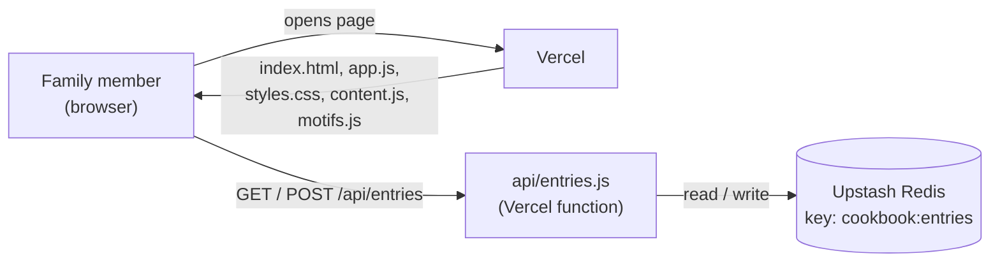
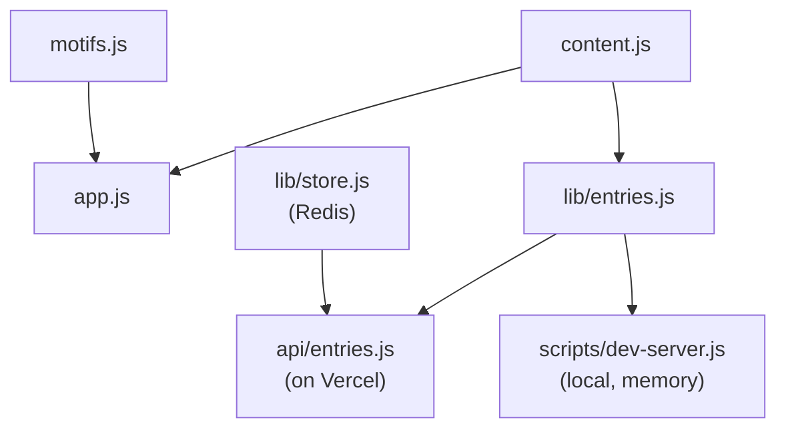
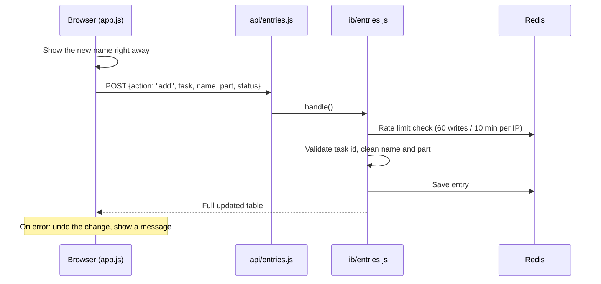

# Architecture

A family task board for Grandma's cookbook, in three languages (Hebrew / German / English).
It has two parts: a **static page** in the browser, and **one small API** that saves the sign-up table.

## The big picture

- **Vercel** serves the files and runs the API. No build step.
- **Redis** keeps the table. That's the only data storage.
- **No login.** Anyone with the link can view and edit.

## Files

| File | What it does |
|---|---|
| `index.html` | Empty page shell. Loads the CSS and `app.js`. |
| `app.js` | Draws the whole page and talks to the API. |
| `content.js` | All texts, tasks and tips in 3 languages. Used by the page **and** the API. |
| `motifs.js` | Builds the embroidery-style SVG decorations. |
| `styles.css` | Look and layout. |
| `api/entries.js` | The API entry point on Vercel. |
| `lib/entries.js` | The table rules: checks input, rate limit, add / update / remove. |
| `lib/store.js` | Connects to Redis using Vercel's environment variables. |
| `scripts/dev-server.js` | Local preview. Same API, but data lives in memory. |
| `test/entries.test.js` | Tests for `lib/entries.js`. |

## How the code connects

`lib/entries.js` does not know about Redis. It gets a "store" handed to it,
so the same rules run on Vercel (Redis), locally (memory) and in tests (fake store).

## What happens when someone signs up

The API has one route, `/api/entries`:

- `GET` returns all entries.
- `POST` with `action` = `add`, `status` or `remove`.

## Staying in sync

- The page reloads the table **every 20 seconds** while the tab is visible.
- It also reloads when you come back to the tab.
- It pauses while you're filling in a form, so your typing isn't lost.
- Your language and name are remembered in the browser (`localStorage`).

## Limits

- 60 writes per IP every 10 minutes.
- 400 entries max in the table.
- Name up to 40 characters, part up to 80.

## Local vs. live

| | Local (`npm run dev`) | Live (Vercel) |
|---|---|---|
| Server | `scripts/dev-server.js` | Vercel static hosting + function |
| Data | Memory, lost on restart | Upstash Redis |
| URL | http://localhost:3000 | https://savta-cookbook.vercel.app |
